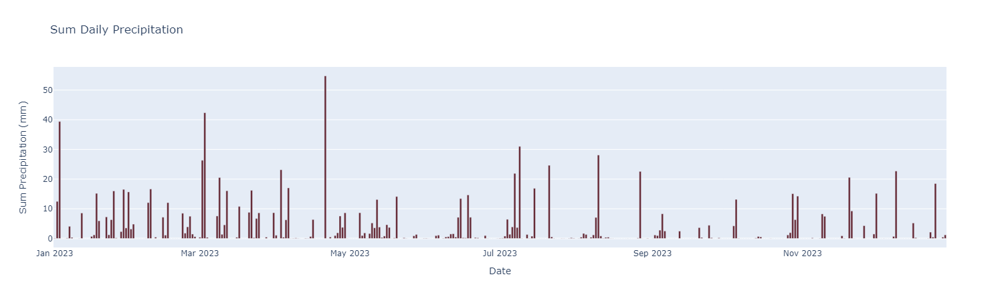
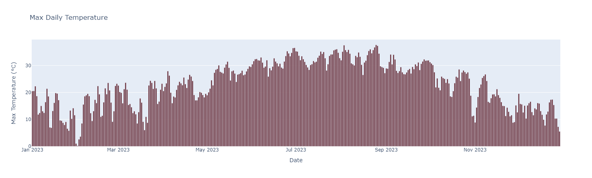
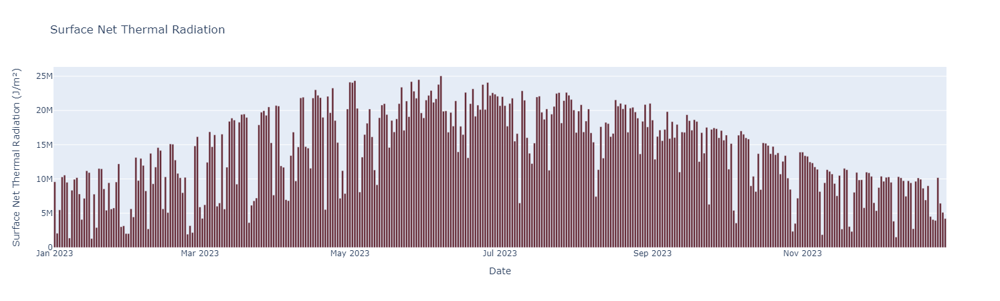

## Getting Started

### Prerequisites

- Python 3.x
- Jupyter Notebook
- Required Python libraries: `pandas`, `geopandas`, `scipy`, `plotly`, `earthengine-api`

### Installation

1. Clone the repository:
   ```bash
   git clone [https://github.com/andersonBudziak/msu_timeseries_ndvi.git]
   ```
2. Navigate to the cloned directory and install the required Python packages:
   ```bash
   pip install -r requirements.txt
   ```

## Usage

### Running the Code in a Jupyter Notebook

1. Open your Jupyter Notebook environment.
2. Set up the analysis by defining your input data and parameters.
3. Execute the code blocks to process and analyze the NDVI data.


# Environmental Data Visualization

This repository contains visualizations of key environmental parameters for a specific region. The data covers daily records throughout the year 2023 and includes:

1. **Sum Daily Precipitation**
2. **Max Daily Temperature**
3. **Surface Net Thermal Radiation**

### Sum Daily Precipitation


- **Description:** This plot displays the sum of daily precipitation in millimeters. It highlights the variability in daily rainfall, with significant peaks indicating days with substantial precipitation. The graph provides a clear visualization of rainy and dry periods over the year.

### Max Daily Temperature


- **Description:** This plot shows the maximum daily temperature in degrees Celsius. The data reveals seasonal temperature variations, with higher temperatures during the summer months and lower temperatures during the winter months. The plot helps in understanding the temperature trends and extremes experienced throughout the year.

### Surface Net Thermal Radiation


- **Description:** This plot illustrates the surface net thermal radiation measured in joules per square meter. It represents the amount of thermal energy radiated from the surface, which can be influenced by factors such as solar radiation and surface characteristics. The graph shows the daily fluctuations and seasonal trends in thermal radiation.

### Usage
- These visualizations can be used for environmental analysis, agricultural planning, and climate studies.
- Researchers and analysts can derive insights into precipitation patterns, temperature extremes, and energy balance from the surface.

### Acknowledgments
- Data Source: [Specify the data source if available]
- Visualization created using [mention any tools or libraries used, e.g., Matplotlib, Seaborn, Plotly].

Feel free to explore the visualizations and use them for your analysis.

## License

This project is licensed under the [GCERLab License](https://www.gcerlab.com/).
